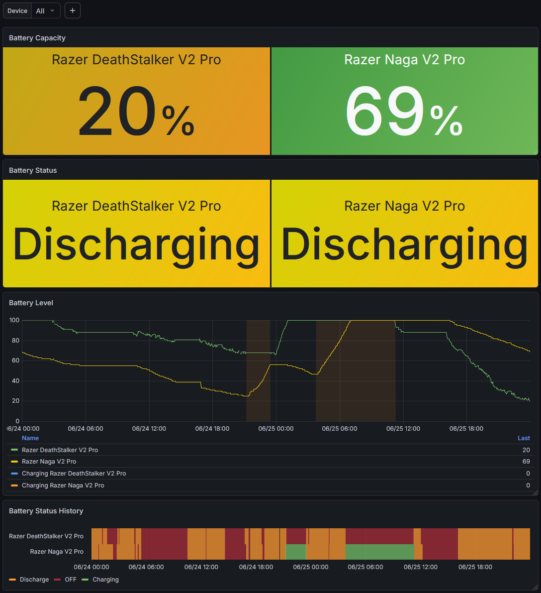

# Razer Synapse 4 Battery Exporter

Prometheus exporter for Razer Synapse 4 device battery levels on Windows.

The exporter reads the current user's Razer Synapse 4 systray logs and exposes
battery metrics for devices such as wireless mice and keyboards.

The exporter is read-only. It does not control Razer Synapse, does not talk to
Razer devices, and does not change device or Synapse state. Its logic only reads
already existing text log files written by Razer Synapse.

This project is not affiliated with, endorsed by, or supported by Razer.

## How It Works

Razer Synapse 4 writes device snapshots to logs under:

```text
%LOCALAPPDATA%\Razer\RazerAppEngine\User Data\Logs\
```

The exporter looks for `systray_systrayv*.log` files on every scrape, tries them
from newest to oldest, and reads each file from the end until it finds a valid
`devices:` snapshot with battery-capable devices.

All data comes from those existing local log files. The exporter does not use
Razer device APIs or send commands to Synapse.

This is intentionally tolerant of Synapse log rotation: if a new log file exists
but does not yet contain device data, the exporter falls back to an older log
that still has the latest valid snapshot.

## Metrics

Default endpoint:

```text
http://localhost:9978/metrics
```

Example output:

```text
# HELP razer_device_battery_level Razer device battery level in percent.
# TYPE razer_device_battery_level gauge
razer_device_battery_level{name="Razer Naga V2 Pro",serial="PM2403H24700999",category="MOUSE"} 63
razer_device_battery_level{name="Razer DeathStalker V2 Pro",serial="PM2252F66100999",category="KEYBOARD"} 14

# HELP razer_device_battery_status Razer device charging status: 0 unknown/off, 1 full/not charging, 2 charging.
# TYPE razer_device_battery_status gauge
razer_device_battery_status{name="Razer Naga V2 Pro",serial="PM2403H24700999",category="MOUSE"} 1
razer_device_battery_status{name="Razer DeathStalker V2 Pro",serial="PM2252F66100999",category="KEYBOARD"} 1

# HELP razer_exporter_build_info Razer Synapse 4 Battery Exporter build information.
# TYPE razer_exporter_build_info gauge
razer_exporter_build_info{version="v0.1.0",commit="e025c71",build_date="2026-06-26T00:00:00Z"} 1

# HELP razer_exporter_scrape_duration_milliseconds Time spent handling this metrics scrape inside the exporter.
# TYPE razer_exporter_scrape_duration_milliseconds gauge
razer_exporter_scrape_duration_milliseconds 4.219
```

Battery status values:

```text
0 unknown/off/any unrecognized value
1 NoCharge_BatteryFull
2 Charging
```

`chargingStatus` is intentionally exported as a numeric metric, not as a label,
so status changes do not create new Prometheus time series.

`razer_exporter_scrape_duration_milliseconds` is measured on every `/metrics`
request. It covers log discovery, file reading, parsing, and Prometheus output
generation inside the exporter. It does not include network transfer time after
the response body is handed to the HTTP server.

`razer_exporter_build_info` exposes the exporter version, git commit, and build
date as labels.

## Run From Source

```powershell
go run ./cmd/razer-synapse4-battery-exporter
```

Print parsed devices once and exit:

```powershell
go run ./cmd/razer-synapse4-battery-exporter -once
```

Use a fixed log file instead of auto-discovery:

```powershell
go run ./cmd/razer-synapse4-battery-exporter -log "$env:LOCALAPPDATA\Razer\RazerAppEngine\User Data\Logs\systray_systrayv261.log"
```

Listen only on localhost:

```powershell
go run ./cmd/razer-synapse4-battery-exporter -listen 127.0.0.1:9978
```

Print version information:

```powershell
go run ./cmd/razer-synapse4-battery-exporter -version
```

## Downloaded Release

Download the versioned Windows package from GitHub Releases and extract it:

```text
razer-synapse4-battery-exporter-v1.0.0-windows-amd64.zip
```

The release package contains one executable:

```text
bin\razer-synapse4-battery-exporter.exe
```

Diagnostic commands print to PowerShell or cmd:

```powershell
.\bin\razer-synapse4-battery-exporter.exe -version
.\bin\razer-synapse4-battery-exporter.exe -once
```

Normal server mode detaches from the console and runs quietly:

```powershell
.\bin\razer-synapse4-battery-exporter.exe
```

Then check:

```powershell
curl http://localhost:9978/metrics
```

For normal use, run the installer from the extracted package:

```powershell
.\scripts\install.ps1
```

## Build From Source

Requirements:

- Windows
- Go 1.26 or newer

Build the background executable:

```powershell
go build -o bin\razer-synapse4-battery-exporter.exe ./cmd/razer-synapse4-battery-exporter
```

Check version information:

```powershell
.\bin\razer-synapse4-battery-exporter.exe -version
```

## Install For Current User

Do not install this exporter as a Windows Service. Razer Synapse logs live under
the interactive user's `%LOCALAPPDATA%`, so a service account may read the wrong
profile.

Use the Task Scheduler installer instead:

```powershell
.\scripts\install.ps1
```

The installer exists to remove the manual Windows setup steps for the current
user. It copies the built executable, creates or updates the scheduled task,
configures the logon trigger and startup delay, and starts the task immediately.
If the local `bin\razer-synapse4-battery-exporter.exe` build is missing, the
installer builds it automatically before copying it to `Program Files`.

Choose:

```text
1. Install or update user logon task
2. Uninstall user logon task
```

The installer:

- copies the executable to `C:\Program Files\razer-synapse4-battery-exporter`;
- creates a Task Scheduler task named `Razer Synapse 4 Battery Exporter`;
- starts it at user logon after a 30-second delay;
- runs it in the current user's interactive context;
- starts the task immediately after installation or update;
- waits until the task is running and verifies that `/metrics` responds.

During an update, the installer stops the existing running task before copying
the new executable. Windows Task Scheduler may record that deliberate stop as
`0x41306`, but the installer then starts the task again and checks that metrics
are available.

If the script is started without Administrator rights, it requests UAC
elevation, waits for the elevated installer process to finish, then prints the
final status back in the original console. If the elevated process fails, error
details are written to the install log. On successful runs the log may not be
created.

```text
%TEMP%\razer-synapse4-battery-exporter-install.log
```

Non-interactive mode:

```powershell
.\scripts\install.ps1 -Action install
.\scripts\install.ps1 -Action uninstall
```

## Prometheus Scrape Config

```yaml
scrape_configs:
  - job_name: razer-synapse4-battery-exporter
    static_configs:
      - targets:
          - windows-hostname:9978
```

If Prometheus runs on the same machine:

```yaml
scrape_configs:
  - job_name: razer-synapse4-battery-exporter
    static_configs:
      - targets:
          - localhost:9978
```

## Grafana Dashboard

Grafana dashboard files can be placed under:

```text
docs/grafana/
```

Recommended filenames:

```text
docs/grafana/dashboard.json
docs/grafana/screenshot.png
```

When `docs/grafana/screenshot.png` is added, it will be displayed here:



## License

MIT
